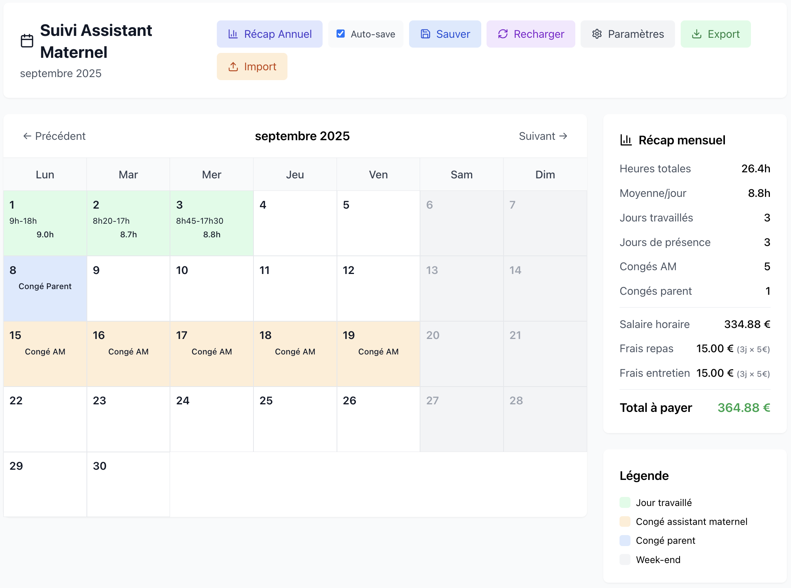

# 🍼 AssmatTracker

> **Application de suivi des heures d'assistant maternel**  
> Gestion complète des heures de garde, calculs automatiques des salaires et récapitulatifs mensuels/annuels.




## 📋 Description

**AssmatTracker** est une application web conçue pour simplifier le suivi des heures de garde chez un(e) assistant(e) maternel(le). Elle permet de :

- 📅 **Saisir facilement** les heures de dépôt/reprise quotidiennes
- 💰 **Calculer automatiquement** les salaires avec ou sans majorations
- 📊 **Générer des récaps** mensuels et annuels détaillés
- 💾 **Sauvegarder automatiquement** toutes les données
- 📁 **Exporter/importer** les données en JSON
- 🏠 **Fonctionner offline** une fois déployée

## ✨ Fonctionnalités principales

### 🗓️ Calendrier interactif
- Vue mensuelle avec navigation année/mois
- Code couleur : jours travaillés (vert), congés AM (orange), congés parent (bleu)
- Saisie rapide par clic sur les dates
- Affichage des horaires et heures totales

### 💸 Gestion avancée des salaires
- **Tarif horaire configurable** avec majorations après X heures
- **Frais mensualisés** : repas et entretien calculés sur jours réels
- **Congés payés** : assistant maternel et parents
- **Calculs en temps réel** avec transparence totale

### 📈 Récapitulatifs complets
- **Mensuel** : heures, jours, salaires, frais détaillés
- **Annuel** : totaux, moyennes, tableau mensuel comparatif
- **Navigation temporelle** : consulter n'importe quelle année

### 💾 Persistance des données
- **Auto-save** configurable (sauvegarde après 1s d'inactivité)
- **Sauvegarde manuelle** avec bouton dédié
- **Export/Import JSON** pour backup et migration
- **API REST** pour synchronisation serveur

## 🏗️ Architecture technique

```
assmat-tracker/
├── 📁 frontend/          # Interface React + Tailwind CSS
│   ├── src/app.js        # Application principale
│   ├── package.json      # Dépendances frontend
│   └── Dockerfile        # Build React optimisé
├── 📁 backend/           # API Express minimaliste  
│   ├── server.js         # Serveur REST + serving statique
│   ├── package.json      # Dépendances Node.js
│   └── Dockerfile        # Runtime Node.js
├── 📁 data/              # Stockage JSON persistant
│   ├── 2025-01.json      # Données janvier 2025
│   ├── 2025-02.json      # Données février 2025
│   └── settings.json     # Paramètres globaux
├── docker-compose.yml    # Déploiement complet
└── README.md            # Documentation
```

### Stack technique
- **Frontend** : React 18, Tailwind CSS, Lucide Icons
- **Backend** : Node.js 18, Express.js, CORS
- **Base de données** : Fichiers JSON (pour la simplicité)
- **Déploiement** : Docker + Docker Compose
- **Compatibilité** : Synology NAS, serveurs Linux

## 🚀 Installation et utilisation

### Prérequis
- Node.js 18+ et npm (pour développement)
- Docker et Docker Compose (pour production)

### 🛠️ Développement local

```bash
# 1. Cloner le projet
git clone https://github.com/username/assmat-tracker.git
cd assmat-tracker

# 2. Backend
cd backend
npm install
npm run dev  # Démarre sur http://localhost:3001

# 3. Frontend (nouveau terminal)
cd ../frontend
npm install  
npm start    # Démarre sur http://localhost:3000
```

L'application sera accessible sur **http://localhost:3000**

### 🐳 Déploiement Docker (Production)

#### Option 1 : Docker Compose (Recommandé)
```bash
# Déploiement en une commande
docker-compose up -d

# Vérification des logs
docker-compose logs -f

# Accès : http://your-server-ip:3000
```

#### Option 2 : Build manuel
```bash
# Build de l'image
docker build -t assmat-tracker .

# Lancement avec volume de données
docker run -d \
  --name assmat-tracker \
  -p 3000:3001 \
  -v $(pwd)/data:/app/data \
  --restart unless-stopped \
  assmat-tracker
```

### 🏠 Déploiement Synology NAS

1. **Activer Docker** dans le Gestionnaire de Paquets
2. **Créer un dossier** `/docker/assmat-tracker` 
3. **Uploader les fichiers** du projet
4. **SSH sur le NAS** :
```bash
cd /volume1/docker/assmat-tracker
sudo docker-compose up -d
```
5. **Configurer** le reverse proxy si nécessaire
6. **Accès** : `http://nas-ip:3000`

## ⚙️ Configuration

### Paramètres de l'application
Configurables via l'interface ou directement dans `data/settings.json` :

```json
{
  "tarifHoraire": 4.5,
  "tarifMajoration": 1.25,
  "seuilMajoration": 9,
  "fraisRepas": 5,
  "fraisEntretien": 8,
  "joursMenualises": 22
}
```

### Variables d'environnement
```bash
# Backend
PORT=3001                 # Port d'écoute du serveur
NODE_ENV=production       # Mode production

# Docker
COMPOSE_PROJECT_NAME=assmat-tracker
```

## 📡 API Endpoints

### Données mensuelles
```bash
# Lire les données d'un mois
GET /api/data/:month      # Ex: /api/data/2025-01

# Sauvegarder les données d'un mois  
POST /api/data/:month
Content-Type: application/json
{
  "dailyData": {
    "2025-01-15": {
      "depot": "08:30",
      "reprise": "17:00", 
      "status": "normal",
      "notes": ""
    }
  }
}
```

### Paramètres globaux
```bash
# Lire les paramètres
GET /api/settings

# Sauvegarder les paramètres
POST /api/settings
Content-Type: application/json
{
  "tarifHoraire": 4.5,
  "seuilMajoration": 9,
  ...
}
```

### Métadonnées
```bash
# Lister les mois disponibles
GET /api/months
# Retourne: ["2025-01", "2025-02", ...]
```

## 📊 Utilisation quotidienne

### 1. Saisie des heures
- Cliquer sur une date du calendrier
- Saisir l'heure de **dépôt** et de **reprise**
- L'application calcule automatiquement les heures et majorations
- Sauvegarde automatique après 1 seconde

### 2. Gestion des congés  
- Sélectionner **"Congé assistant maternel"** = payé
- Sélectionner **"Pas de dépôt (congé parent)"** = payé
- Les congés sont comptabilisés dans les calculs

### 3. Consultation des récaps
- **Récap mensuel** : panneau de droite, mis à jour en temps réel
- **Récap annuel** : bouton "Récap Annuel" → vue complète avec navigation années

### 4. Export/Import
- **Export** : bouton vert pour télécharger le JSON du mois
- **Import** : bouton orange pour charger un fichier JSON
- **Format** : compatible avec les sauvegardes automatiques

## 🔧 Maintenance

### Sauvegarde des données
```bash
# Backup du dossier data complet
cp -r data/ backup-$(date +%Y%m%d)/

# Restauration 
cp -r backup-YYYYMMDD/ data/
docker-compose restart
```

### Logs et monitoring
```bash
# Logs Docker
docker-compose logs -f

# Espace disque des données
du -sh data/

# Santé du container
docker-compose ps
```

### Mise à jour
```bash
# Pull des dernières modifications
git pull origin main

# Rebuild et redémarrage
docker-compose down
docker-compose up -d --build
```

## 🤝 Contribution

Les contributions sont les bienvenues ! Pour contribuer :

1. **Fork** le projet
2. **Créer** une branche feature (`git checkout -b feature/amazing-feature`)  
3. **Commit** les changements (`git commit -m 'Add amazing feature'`)
4. **Push** la branche (`git push origin feature/amazing-feature`)
5. **Ouvrir** une Pull Request

## 📄 Licence

Ce projet est sous licence **MIT** - voir le fichier [LICENSE](LICENSE) pour plus de détails.

## 🆘 Support

- 🐛 **Issues** : [GitHub Issues](https://github.com/jleparoux/assmat-tracker/issues)
- 💬 **Discussions** : [GitHub Discussions](https://github.com/jleparoux/assmat-tracker/discussions)  
- 📧 **Email** : julien.leparoux@gmail.com


---

⭐ **N'hésitez pas à mettre une étoile si ce projet vous aide !** ⭐